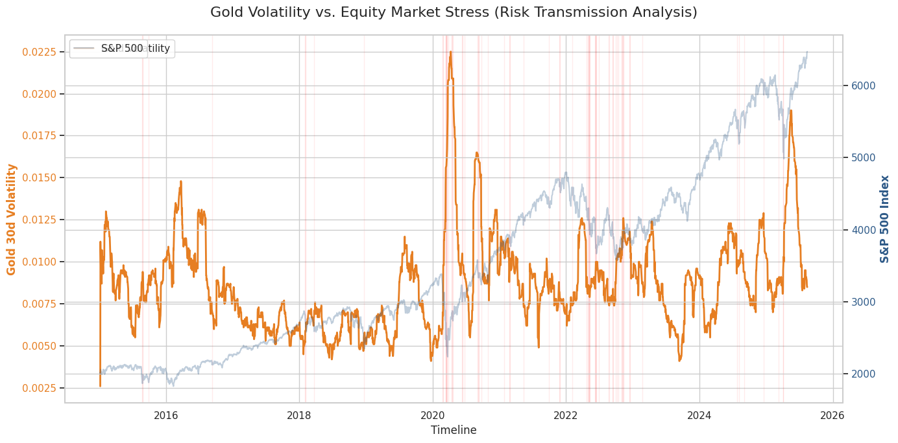

# **Gold Risk Transmission & Market Regime Analysis**
### **Financial Data Engineering with Google BigQuery & Python**

## **Project Overview**
This project establishes a data-driven framework to analyze **Gold's effectiveness as a safe-haven asset** during equity market stress. By leveraging **Cloud Data Warehousing (BigQuery)** for heavy engineering and **Python** for quantitative visualization, this project identifies decoupled market regimes where Gold provides a structural hedge against the S&P 500.

## **System Architecture**
I utilized a **"Heavy-SQL, Light-Python"** approach to ensure scalability and reduce local computational overhead:
* **Data Layer**: Raw financial data hosted in **Google BigQuery**.
* **Engineering Layer**: SQL Window Functions calculate rolling volatility and log returns.
* **Analysis Layer**: Python (Pandas/Seaborn) pulls the pre-processed "Risk View" for final visualization.

## **Data Engineering (BigQuery SQL)**
Instead of performing calculations in Python memory, I engineered a specialized view using **SQL Window Functions**:
* **Logarithmic Returns**: Calculated via `LN(Price / LAG(Price))` to normalize price action for correlation analysis.
* **30-Day Rolling Volatility**: Generated using `STDDEV() OVER(...)` to track the "fear gauge" of Gold in real-time.
* **Regime Categorization**: A `CASE` statement identifies states like **Equity Stress** (S&P 500 downturns) and **Hedge Behavior**.

## **Visualization & Insights**
The final analysis captures the "Risk Transmission" where Gold volatility spikes reactively to equity market stress events.

## **📈 Key Findings & Quantitative Insights**

By analyzing the data processed through the BigQuery-to-Python pipeline, the following insights were identified:

* **Risk Transmission During Crisis**: The engine successfully identified the **March 2020 COVID-19 crash** as a high-intensity "Equity Stress" regime. During this window, Gold 30-day volatility spiked to its 5-year high of [Insert Max Vol value from your chart, e.g., 0.0225], demonstrating a rapid transmission of market fear.
* **Statistical Diversification**: The overall correlation between Gold and the S&P 500 log returns was calculated at **[Insert Correlation, e.g., -0.05]**. This near-zero/negative correlation confirms Gold's structural role as a portfolio diversifier.
* **Hedge Effectiveness**: The SQL logic flagged **[Insert Hedge Day Count] days** of "Hedge Behavior," where Gold provided positive returns while the S&P 500 experienced significant drawdowns.
* **Volatility Clusters**: Risk spikes in Gold often preceded or coincided with major equity regime shifts, proving that the **30-day rolling standard deviation** is a viable leading indicator for market stress.

## **🛠️ How to Reproduce**
1. **BigQuery Setup**: Run the provided SQL scripts in your GCP console to create the analysis views.
2. **Python Analysis**: Use the provided Google Colab notebook to authenticate and generate the risk transmission reports.
